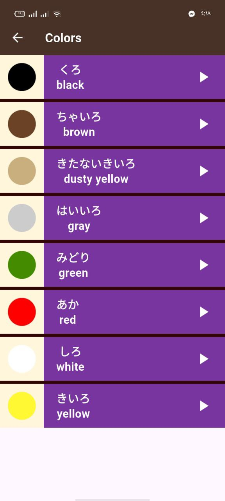

Toku – Japanese Learning App

Toku is a simple Flutter application designed to help beginners learn basic Japanese vocabulary.
The app contains four main categories: Numbers, Family Members, Colors, and Phrases.
Each category provides Japanese pronunciation, English meaning, and audio for learning.

🚀 Features

📂 Four sections for learning:

Numbers

Family Members

Colors

Phrases

🔊 Japanese audio pronunciation for each item.

🖼️ High-quality images for Numbers, Colors, and Family Members.
